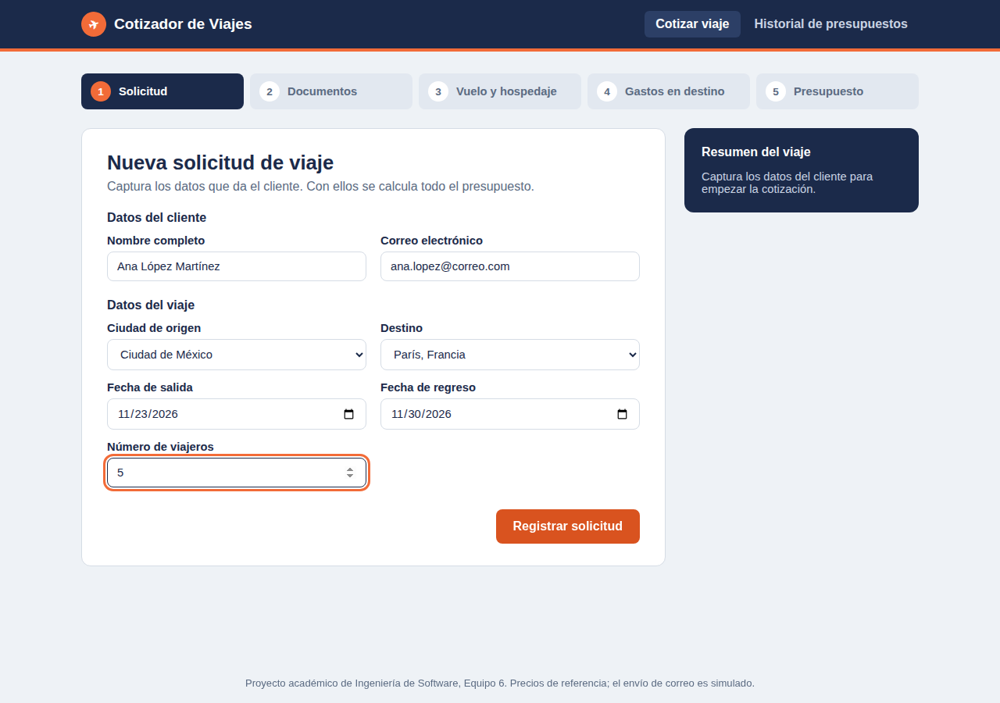
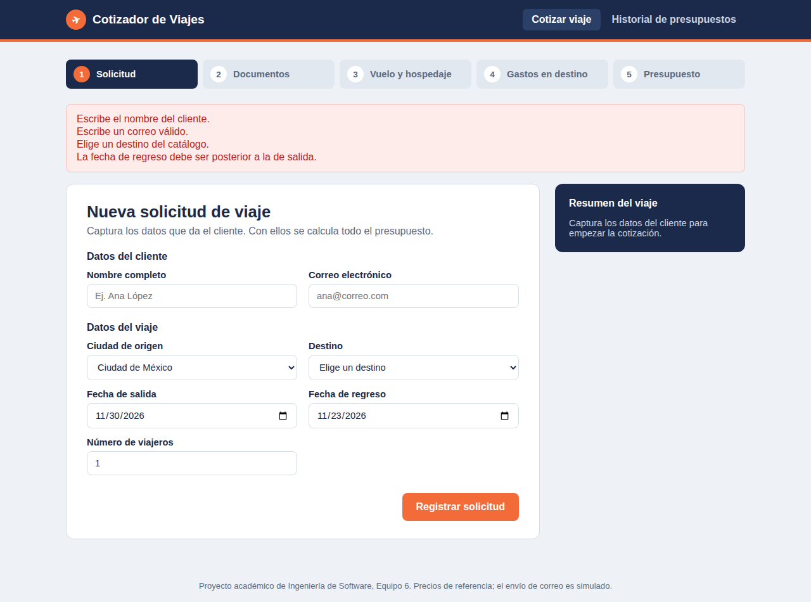
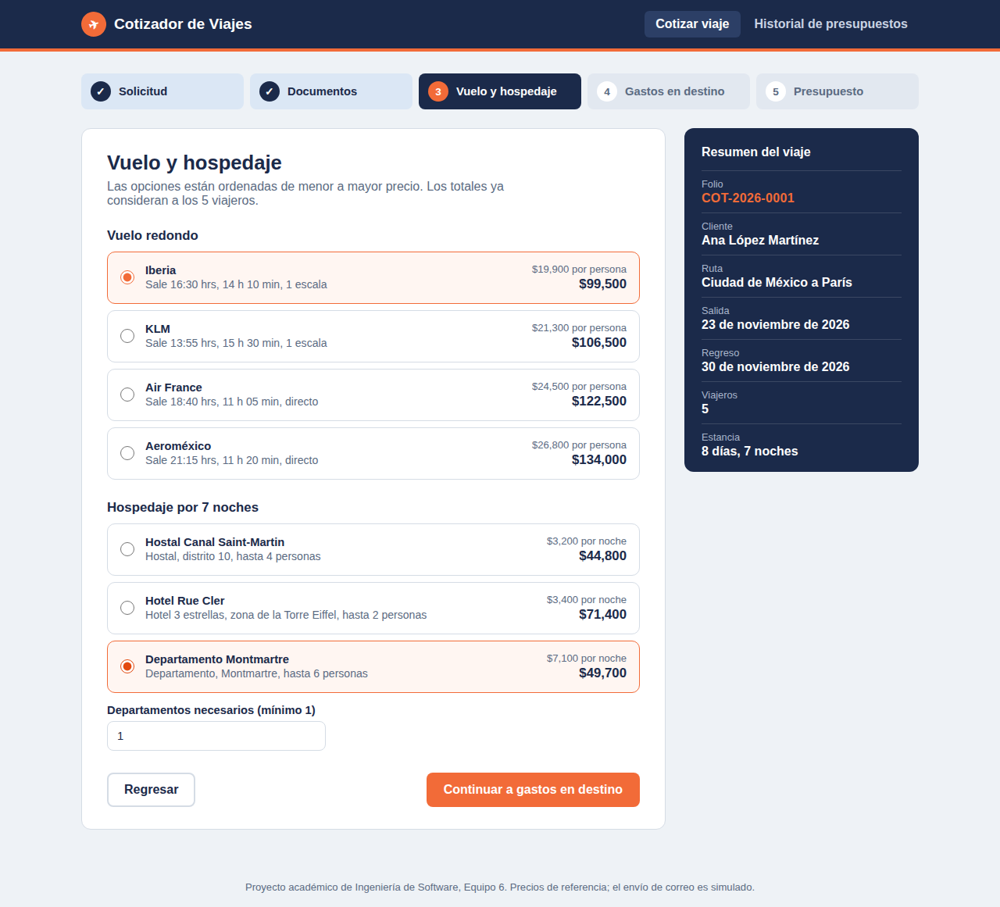
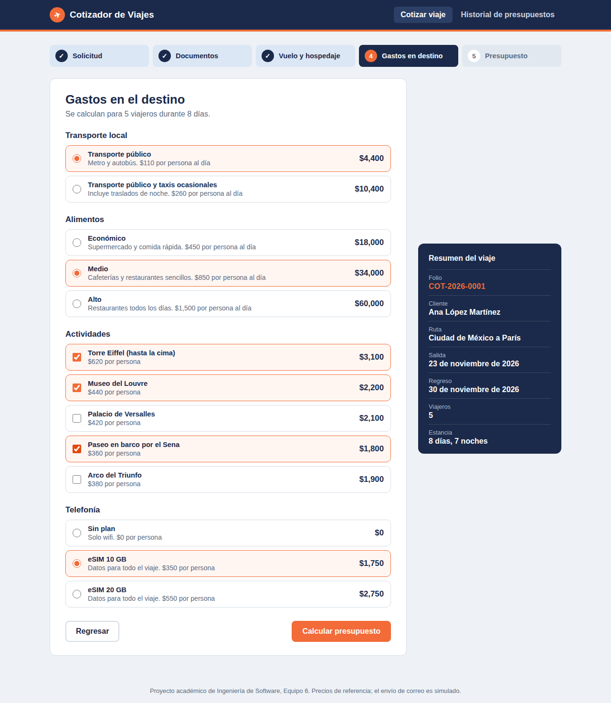
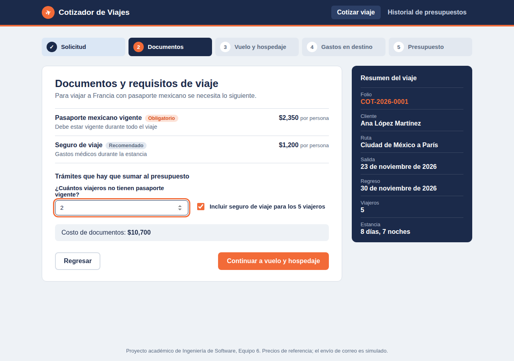
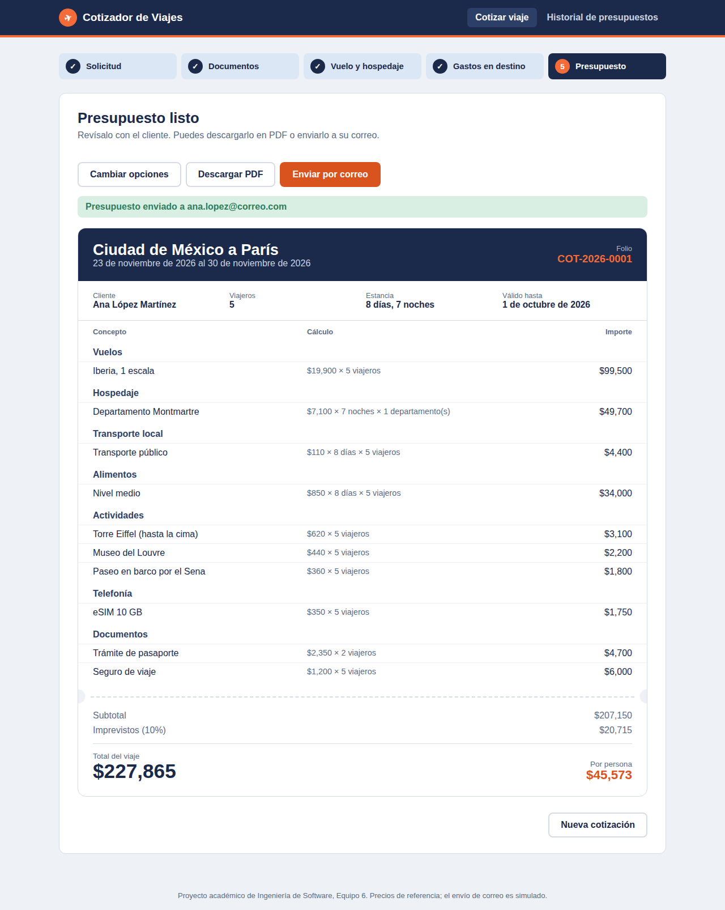
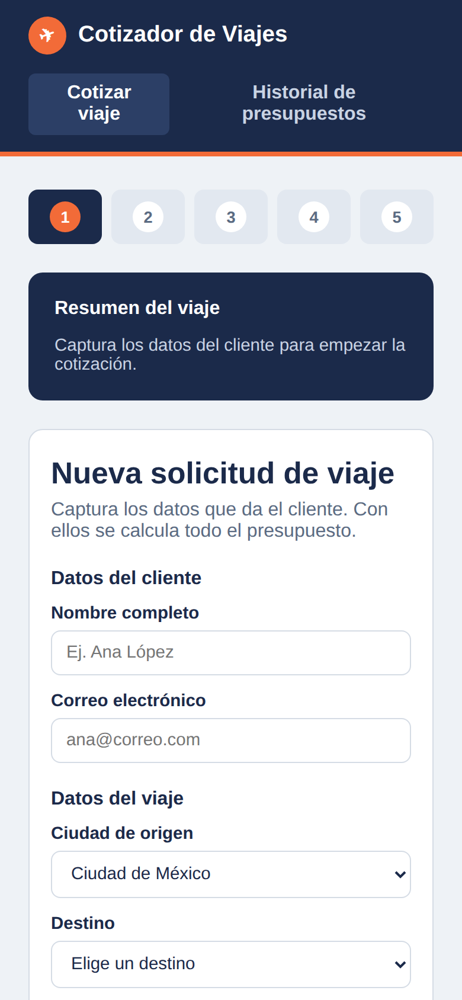
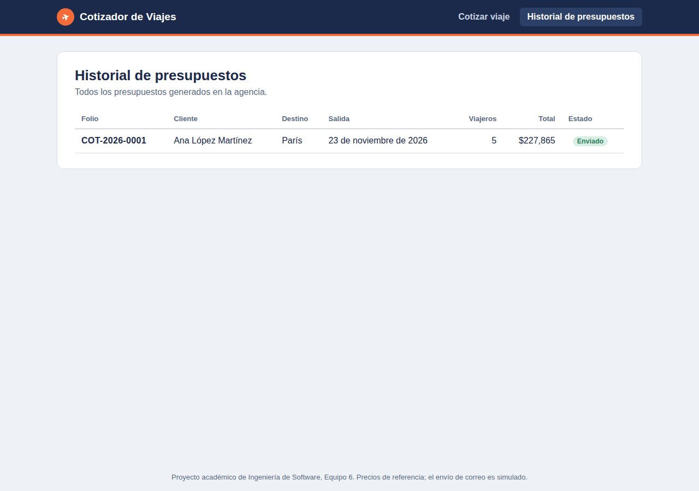

# Sistema de Cotización de Viajes

Prototipo del proyecto de Ingeniería de Software, Sprint 1.

**Universidad Nacional Autónoma de México, FES Acatlán**
Matemáticas Aplicadas y Computación
Grupo 1552, Equipo 6
Profesora: Maritza Nova Juárez

Integrantes:
- Avila Torres Alex Ferran
- Hernandez Olayo Luis Eduardo
- Monroy Hernandez Patrick
- Pantoja Galmiche Angel David
- Ruiz Cruz José Armando

Aplicación en línea: https://cotizador-viajes-ugqr.onrender.com

---

## Contenido

1. [Planteamiento del problema](#1-planteamiento-del-problema)
2. [Alcance del Sprint 1](#2-alcance-del-sprint-1)
3. [Requerimiento de usuario y su flujo en la aplicación](#3-requerimiento-de-usuario-y-su-flujo-en-la-aplicación)
4. [Requerimientos funcionales y cómo se implementaron](#4-requerimientos-funcionales-y-cómo-se-implementaron)
5. [Matriz de trazabilidad](#5-matriz-de-trazabilidad)
6. [Requerimientos no funcionales](#6-requerimientos-no-funcionales)
7. [Puntos de vista](#7-puntos-de-vista)
8. [Validación y caso de prueba](#8-validación-y-caso-de-prueba)
9. [Software utilizado](#9-software-utilizado)
10. [Estructura del proyecto](#10-estructura-del-proyecto)
11. [Cómo ejecutarlo](#11-cómo-ejecutarlo)
12. [Limitaciones y siguientes sprints](#12-limitaciones-y-siguientes-sprints)

---

## 1. Planteamiento del problema

Al inicio del semestre planeamos un viaje a París para 5 personas buscando la mejor opción al menor costo. Para hacerlo investigamos por separado vuelos, hospedaje, transporte, comida, actividades, telefonía y documentos de viaje, y juntamos todo a mano en hojas de cálculo. Fue tardado, era fácil equivocarse al sumar y cada vez que cambiábamos una opción había que rehacer las cuentas.

Una agencia de viajes tiene el mismo problema cada vez que un cliente le pide cotizar un viaje. Este sistema recibe los datos del viaje (destino, fechas, número de personas, noches de hospedaje, tarifas, imprevistos y servicios adicionales) y entrega un presupuesto con el costo total, el costo por persona y el desglose de cada concepto.

## 2. Alcance del Sprint 1

En esta primera etapa el sistema **solo elabora el presupuesto**. La compra, reservación o pago de los servicios no forma parte de este sprint.

Los precios están cargados en un catálogo dentro del sistema a partir de nuestra investigación, en lugar de consultarse en línea con aerolíneas u hoteles. Esto se decidió en la validación de realismo de RF-02 (ver sección 8).

## 3. Requerimiento de usuario y su flujo en la aplicación

> El software debe proveer un medio para elaborar el presupuesto de un viaje a partir de la solicitud de un cliente, considerando vuelos, hospedaje, transporte, alimentos, actividades, telefonía y documentos de viaje.

En el documento de la entrega describimos 8 pasos para generar el presupuesto inicial. La aplicación los agrupa en 5 pantallas que se recorren en orden. La barra de pasos en la parte superior indica en qué punto del proceso está el agente.

| Paso del documento | Pantalla de la aplicación | Requerimiento |
|---|---|---|
| 1. Recepción de la solicitud del cliente | 1. Solicitud | RF-01 |
| 2. Revisión de documentos y requisitos | 2. Documentos | RF-04 |
| 3. Búsqueda y comparación de vuelos | 3. Vuelo y hospedaje | RF-02 |
| 4. Búsqueda y comparación de hospedaje | 3. Vuelo y hospedaje | RF-02 |
| 5. Transporte local y telefonía | 4. Gastos en destino | RF-03 |
| 6. Alimentos y actividades | 4. Gastos en destino | RF-03 |
| 7. Cálculo del presupuesto | 5. Presupuesto | RF-05 |
| 8. Entrega del presupuesto | 5. Presupuesto | RF-05 |

El orden de las pantallas sigue el proceso que hicimos al planear París. Por eso los documentos (RF-04) se revisan antes que los vuelos (RF-02), aunque su número de requerimiento sea mayor.

## 4. Requerimientos funcionales y cómo se implementaron

Para cada requerimiento se indica qué dice la especificación y dónde se cumple en la aplicación.

### RF-01: Registro de la solicitud de viaje



| Especificación | Implementación |
|---|---|
| **Entradas:** nombre y correo del cliente, origen, destino, fechas de salida y regreso, número de viajeros | Formulario en `client/src/pasos/PasoSolicitud.jsx` |
| **Acción:** revisar campos obligatorios | El servidor revisa que no falte ningún dato y responde con la lista de errores |
| **Acción:** fecha de regreso posterior a la de salida, viajeros mayor a cero | Validaciones en `POST /api/solicitudes` (`server/index.js`). Además, la salida no puede ser anterior a hoy y el grupo va de 1 a 20 personas |
| **Acción:** calcular días y noches | `noches = regreso - salida` y `días = noches + 1` |
| **Salida:** solicitud con folio | Folio con formato `COT-2026-0001` |
| **Requerimiento:** destino dado de alta en el catálogo | Si el destino no existe, la solicitud se rechaza |
| **Efecto colateral:** si los datos son incorrectos no se registra | Se muestra un aviso con cada error y no se avanza al siguiente paso |



### RF-02: Cotización de vuelos y hospedaje



| Especificación | Implementación |
|---|---|
| **Acción:** buscar vuelos del origen al destino | `GET /api/vuelos`. El precio incluye un recargo según la ciudad de origen |
| **Acción:** mostrar opciones ordenadas de menor a mayor | Las listas se ordenan por precio en el servidor |
| **Acción:** costo de vuelos = boleto × viajeros | Se muestra junto a cada opción y se recalcula en el presupuesto |
| **Acción:** costo de hospedaje = precio por noche × noches × habitaciones | Las habitaciones mínimas se calculan con la capacidad de cada hospedaje (`viajeros / capacidad`, redondeado hacia arriba). El agente puede aumentar el número, pero no bajarlo del mínimo |
| **Completitud (validación):** mostrar aerolínea, horario y escalas; ubicación y tipo de hospedaje | Cada opción muestra esos datos |
| **Precondición:** solicitud registrada | La pantalla solo se abre después de RF-01 y el botón para continuar se habilita al elegir vuelo y hospedaje |

### RF-03: Cotización de gastos en el destino



| Especificación | Implementación |
|---|---|
| **Transporte local** = costo por día × días × viajeros | Dos opciones en el catálogo |
| **Alimentos** = cuota diaria × días × viajeros | Tres niveles: económico, medio y alto |
| **Actividades** = entrada × viajeros, por actividad | Lista de actividades propia de cada destino, se pueden elegir varias |
| **Telefonía** = costo del plan × viajeros | Incluye la opción "Sin plan" |
| **Efecto colateral:** un concepto no elegido queda en cero y no aparece | En el presupuesto solo se listan los conceptos con importe mayor a cero |

### RF-04: Documentos y requisitos de viaje



| Especificación | Implementación |
|---|---|
| **Acción:** consultar requisitos del país destino | `GET /api/requisitos/:destino` |
| **Acción:** marcar qué viajeros necesitan trámite | Campo "¿Cuántos viajeros no tienen pasaporte vigente?" |
| **Acción:** cobrar el trámite solo a quienes lo necesitan | Pasaporte × viajeros sin pasaporte; el seguro de viaje es opcional para todo el grupo |
| **Completitud (validación):** no cobrar a quien ya tiene pasaporte | Resuelto con el campo anterior, que no puede ser mayor al número de viajeros |

### RF-05: Cálculo y entrega del presupuesto



| Especificación | Implementación |
|---|---|
| **Acción:** sumar todos los conceptos | Función `calcular()` en `server/index.js` |
| **Acción:** agregar imprevistos | 10 % sobre el subtotal (constante `IMPREVISTOS` en el catálogo) |
| **Acción:** total y costo por persona | Se muestran al final del presupuesto |
| **Acción:** fecha de vigencia | 7 días a partir de la fecha en que se genera |
| **Acción:** generar PDF | Botón "Descargar PDF", usa la opción de imprimir del navegador con un estilo de impresión propio |
| **Acción:** enviar al correo y guardar en historial | Botón "Enviar por correo" (simulado en el prototipo); el presupuesto se guarda en el historial en cuanto se genera |
| **Consistencia (validación):** solo se suman conceptos cotizados antes | El servidor recalcula todo a partir de las selecciones y del catálogo; no acepta importes enviados desde las pantallas |
| **Efecto colateral:** si el correo falla, el presupuesto queda guardado | Como se guarda antes del envío, se puede reenviar o descargar |

El botón "Cambiar opciones" regresa al paso anterior para buscar un costo menor, como se indica en el paso 7 del requerimiento de usuario.

## 5. Matriz de trazabilidad

Relación entre cada requerimiento, la pantalla, el código y la ruta del servidor que lo cumplen.

| Requerimiento | Pantalla | Componente (client/src) | Ruta del servidor |
|---|---|---|---|
| RF-01 | Solicitud | `pasos/PasoSolicitud.jsx` | `POST /api/solicitudes` |
| RF-02 | Vuelo y hospedaje | `pasos/PasoVueloHospedaje.jsx` | `GET /api/vuelos`, `GET /api/hospedajes` |
| RF-03 | Gastos en destino | `pasos/PasoGastos.jsx` | `GET /api/gastos/:destino` |
| RF-04 | Documentos | `pasos/PasoDocumentos.jsx` | `GET /api/requisitos/:destino` |
| RF-05 | Presupuesto | `pasos/PasoPresupuesto.jsx` | `POST /api/presupuestos`, `POST /api/presupuestos/:folio/enviar` |
| Punto de vista indirecto | Historial de presupuestos | `Historial.jsx` | `GET /api/presupuestos` |

## 6. Requerimientos no funcionales

| Atributo | Lo que pide el documento | Cómo se atiende en el prototipo |
|---|---|---|
| Mantenibilidad | Sistema dividido en partes para modificar una sin afectar a las demás | Cliente y servidor separados. Cada paso es un componente independiente. Todos los precios están en un solo archivo (`server/data/catalogo.js`), así que actualizarlos no requiere tocar la lógica |
| Confiabilidad y seguridad | Cálculos correctos y datos del cliente usados solo para su cotización | Los cálculos y validaciones se hacen únicamente en el servidor. Los datos del cliente solo se usan para el folio, el presupuesto y el envío |
| Eficiencia | Presupuesto en menos de 5 segundos | El cálculo se hace sobre datos en memoria y responde en milisegundos. Solo la primera carga en Render puede tardar más si el servidor estaba dormido (ver sección 12) |
| Aceptabilidad | Pantallas sencillas, en español, para computadora y celular | Todo el texto está en español, los pasos van en orden y el diseño se adapta a celular |



## 7. Puntos de vista

| Tipo | Actor | Cómo se refleja en la aplicación |
|---|---|---|
| Directo | Agente de viajes | Recorre los 5 pasos y genera el presupuesto |
| Directo | Cliente | Recibe el presupuesto con el desglose, el total y el costo por persona |
| Indirecto | Gerente o dueño de la agencia | Pantalla "Historial de presupuestos" con folio, cliente, destino, total y estado |
| Dominio | Precios de proveedores | Catálogo con precios de referencia y vigencia del presupuesto de 7 días, porque los precios cambian |
| Dominio | Requisitos de entrada del país | Catálogo de requisitos por destino (RF-04) |
| Dominio | Protección de datos personales | Solo se piden los datos necesarios para cotizar |



## 8. Validación y caso de prueba

En el documento validamos cada requerimiento con las cinco comprobaciones vistas en clase. Así se reflejan en el prototipo:

| Comprobación | Cómo se aplicó |
|---|---|
| Validez | Cada pantalla corresponde a una actividad que realmente hicimos al planear el viaje a París |
| Consistencia | Los datos de RF-01 (fechas, viajeros) son los mismos que usan RF-02, RF-03 y RF-04; RF-05 solo suma lo que ya se cotizó |
| Completitud | Están cubiertos todos los factores del planteamiento: vuelos, hospedaje, transporte, alimentos, actividades, telefonía, documentos, número de viajeros y duración |
| Realismo | Se usaron precios en catálogo en lugar de conexiones con proveedores, y el correo se simula, para poder terminar en un sprint |
| Verificabilidad | Cada cálculo se puede comprobar a mano, como se muestra en el caso de prueba siguiente |

### Caso de prueba: viaje a París para 5 personas

Datos: Ciudad de México a París, 7 noches (8 días), 5 viajeros, 2 sin pasaporte vigente, con seguro de viaje.

| Concepto | Cálculo a mano | Resultado esperado | Resultado del sistema |
|---|---|---|---|
| Vuelo Iberia (1 escala) | 19,900 × 5 | 99,500 | 99,500 |
| Departamento Montmartre | 7,100 × 7 × 1 | 49,700 | 49,700 |
| Transporte público | 110 × 8 × 5 | 4,400 | 4,400 |
| Alimentos nivel medio | 850 × 8 × 5 | 34,000 | 34,000 |
| Torre Eiffel | 620 × 5 | 3,100 | 3,100 |
| Museo del Louvre | 440 × 5 | 2,200 | 2,200 |
| Paseo en barco por el Sena | 360 × 5 | 1,800 | 1,800 |
| eSIM 10 GB | 350 × 5 | 1,750 | 1,750 |
| Trámite de pasaporte | 2,350 × 2 | 4,700 | 4,700 |
| Seguro de viaje | 1,200 × 5 | 6,000 | 6,000 |
| **Subtotal** | | **207,150** | **207,150** |
| Imprevistos (10 %) | 207,150 × 0.10 | 20,715 | 20,715 |
| **Total** | | **227,865** | **227,865** |
| Por persona | 227,865 / 5 | 45,573 | 45,573 |

Resultado: el sistema coincide con el cálculo a mano en todos los conceptos.

También se probaron casos de error de RF-01: campos vacíos, correo inválido, fecha de regreso anterior a la de salida y fecha de salida en el pasado. En todos el sistema rechazó la solicitud y mostró el motivo.

## 9. Software utilizado

| Herramienta | Uso | Por qué la elegimos |
|---|---|---|
| React (con Vite) | Pantallas del sistema | Permite dividir la interfaz en componentes, uno por cada paso de la cotización |
| Node.js y Express | Servidor, validaciones y cálculo del presupuesto | Usa JavaScript igual que el cliente, así todo el equipo trabaja en un solo lenguaje |
| GitHub | Control de versiones | Todo el equipo puede ver y subir cambios |
| Render | Publicación en internet | Tiene plan gratuito y publica automáticamente cada cambio que se sube a `main` |

Elegimos estas herramientas porque todos conocemos JavaScript, son gratuitas y tienen mucha documentación.

## 10. Estructura del proyecto

```
agencia-/
├── client/                    Aplicación en React
│   └── src/
│       ├── App.jsx            Control de los pasos y resumen del viaje
│       ├── api.js             Llamadas al servidor
│       ├── Historial.jsx      Historial de presupuestos
│       ├── estilos.css
│       └── pasos/             Una pantalla por requerimiento
│           ├── PasoSolicitud.jsx        RF-01
│           ├── PasoDocumentos.jsx       RF-04
│           ├── PasoVueloHospedaje.jsx   RF-02
│           ├── PasoGastos.jsx           RF-03
│           └── PasoPresupuesto.jsx      RF-05
├── server/
│   ├── index.js               Rutas, validaciones y cálculo del presupuesto
│   └── data/catalogo.js       Precios de referencia y parámetros (imprevistos, vigencia)
├── capturas/                  Pantallas del sistema
├── render.yaml                Configuración de despliegue en Render
└── package.json
```

## 11. Cómo ejecutarlo

Se necesita Node.js 18 o superior.

```bash
git clone https://github.com/Edu-Hdz/agencia-.git
cd agencia-
npm install        # instala también las dependencias de server y client
npm run dev        # servidor en el puerto 3001 y cliente en el 5173
```

Después abrir http://localhost:5173.

Para publicarlo, Render lee el archivo `render.yaml`, instala las dependencias, compila el cliente y arranca el servidor, que muestra tanto la API como las pantallas.

## 12. Limitaciones y siguientes sprints

Limitaciones actuales del prototipo:

- Los precios son de referencia y están en un catálogo fijo.
- Las solicitudes y presupuestos se guardan en memoria; se borran al reiniciar el servidor.
- El envío por correo es simulado.
- En el plan gratuito de Render el servidor se apaga tras unos 15 minutos sin uso, y la primera carga siguiente tarda cerca de un minuto.
- No hay inicio de sesión para agentes ni para el gerente.

Mejoras propuestas para los siguientes sprints:

- Guardar solicitudes y presupuestos en una base de datos.
- Permitir que el gerente actualice los precios del catálogo desde una pantalla.
- Envío real del presupuesto por correo.
- Inicio de sesión con roles (agente y gerente).
- Confirmación de compra de los servicios presupuestados.
